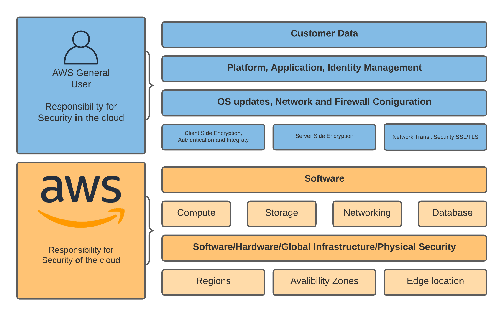

---
title: "Security"
linkTitle: "Security"
weight: 8 
date: 2021-12-27
description: >
  Establish Best Practice to protect the confidentiality and integrity of data
---
Security speaks for itself and as Werner Vogals says “security is job zero”. In this pillar not only do we look at the data you are storing and encryption but we will consider labeling and identifying your data, marking it as sensitive if needed.

#### Shared Responsibility 

Before we get going lets talk about shared responsibility. AWS is responsible for the running of the cloud, you are responsible for whats running in the cloud. If you think of this in terms on EC2, when you launch a server it's running on hardware, amazon looks after that hardware, it's connected to a network and amazon also look after that. Where you come is the instance it's self that you launched, you'll configure the security group around it, you also need to patch the software on it. It's a pretty simple concept but one you need to understand. When it comes to S3 we have a similar story. S3 (the service) is run by amazon, this includes things like making sure all the disks are healthy and the API's are up and running and a plethora of other things. When you create a bucket, by default it's locked down theres no public access. In fact you have to work pretty hard to disable everything and expose your data these days! However, the data is your responsibility and this chapter has some reciepes in to help you look after that data that helps you security your data in the cloud! The diagram below shows the shared responsibility model and where you need to do your bit to protect your data.

