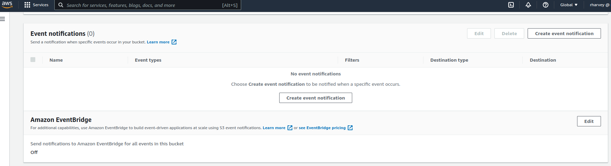
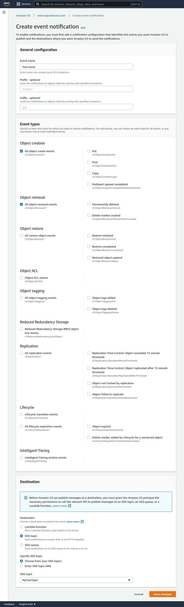

<span class=opex-off>OpEx</span>
<span class=sec-off>Sec</span>
<span class=rel-sec>Rel</span>
<span class=perf-on>Perf</span>
<span class=cost-off>Cost</span>
<span class=sus-off>Sus</span>


## Configuring event notifications via the console

### Publish event messages to an SNS Topic

- Head to the SNS console and create a new topic, Just set the name and leave everything else as standard.
- Make a note of the ARN you'll need this in a second
- Now edit the SNS topic and edit the Acess Policy. We are going to narrow the policy down to SNS:Publish from your bucket only. Make sure your replace <SNS-ARN>, <BUCKET-NAME> and <ACCOUNT-ID> with your details:

```
{
    "Version": "2012-10-17",
    "Id": "example-ID",
    "Statement": [
        {
            "Sid": "Example SNS topic policy",
            "Effect": "Allow",
            "Principal": {
                "Service": "s3.amazonaws.com"
            },
            "Action": [
                "SNS:Publish"
            ],
            "Resource": "<SNS-ARN>",
            "Condition": {
                "ArnLike": {
                    "aws:SourceArn": "arn:aws:s3:*:*:<BUCKET-NAME>"
                },
                "StringEquals": {
                    "aws:SourceAccount": "<ACCOUNT-ID>"
                }
            }
        }
    ]
}
```

- Save your settings
- Now back on the S3 console select your bucket and click edit
- Click on the __Properties__ tab and scroll down to __Notifications__



- Create a new notification and follow the settings in the following screen shot and be sure to select the correct SNS Topic!




